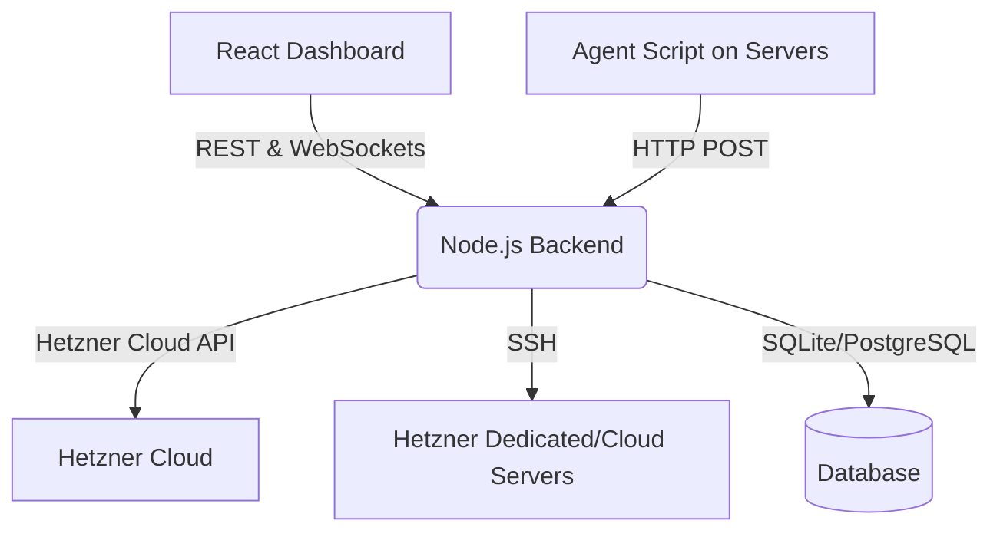

# Hetzner Management Dashboard

A full-stack web application that serves as a unified UI dashboard for managing and monitoring Hetzner servers (both Hetzner Cloud VMs and Dedicated Root Servers).

## Architecture



## Features
- **Server Health & Performance**: Real-time metrics for CPU, RAM, Disk I/O, Network.
- **Hardware Status**: CPU temperatures, SMART data, Uptime.
- **Cloud Resource Management**: Manage Hetzner Cloud VMs, Volumes, Snapshots, IPs.
- **Application & Process Details**: View processes, systemd services, log viewer (journalctl).

## Deployment Instructions

### Prerequisites
- Podman & Podman Compose
- Or Node.js 20+ installed locally

### Step-by-Step Setup (Hetzner Ubuntu Server)
1. **Clone the repository:**
   ```bash
   git clone <your-repo-url> dashboard
   cd dashboard
   ```
2. **Run the setup script:**
   ```bash
   ./setup.sh
   ```
3. **Configure Environment Variables:**
   Edit the `.env` file generated by `setup.sh`:
   - Set `HETZNER_API_TOKEN`
   - Review `ENCRYPTION_KEY` and `JWT_SECRET`
   - Define initial servers in `INITIAL_SERVERS` or use the dashboard UI later.
4. **Deploy with Podman Compose:**
   ```bash
   podman-compose up -d
   ```
5. **Access the Dashboard:**
   Visit `http://<your-server-ip>:80` (or `3000` for backend).

### Adding the Monitoring Agent to New Servers
To gather real-time metrics, you need to deploy the agent script to your servers.

From the central server where the dashboard runs:
```bash
cd scripts
./deploy-agent.sh <target-server-ip> root <path-to-ssh-key> <agent-api-key> http://<dashboard-server-ip>:3000/api/metrics/ingest
```
This automatically copies the agent, sets up a systemd service, and starts reporting metrics.

## Troubleshooting
- **No metrics showing up?** Ensure the `DASHBOARD_URL` in the agent config is accessible from the target server.
- **Hetzner Cloud resources empty?** Verify your `HETZNER_API_TOKEN` is correct and has read/write permissions.
- **SSH Connectivity Issues?** Make sure the central dashboard server's SSH key is added to the target servers' `~/.ssh/authorized_keys`.
